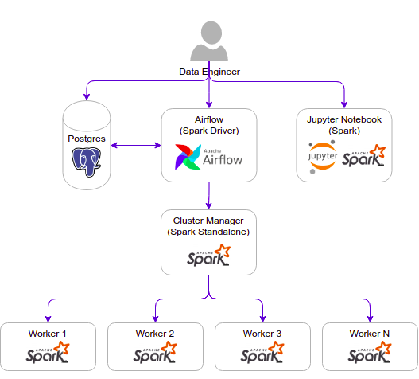
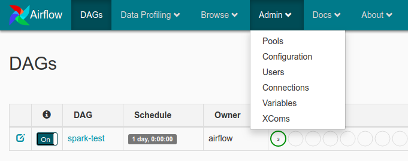
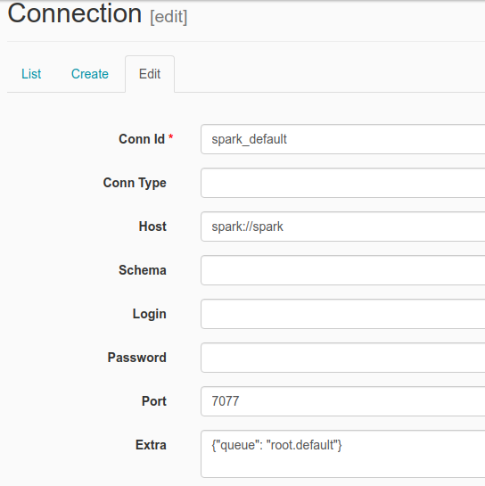
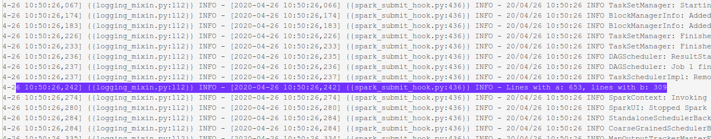
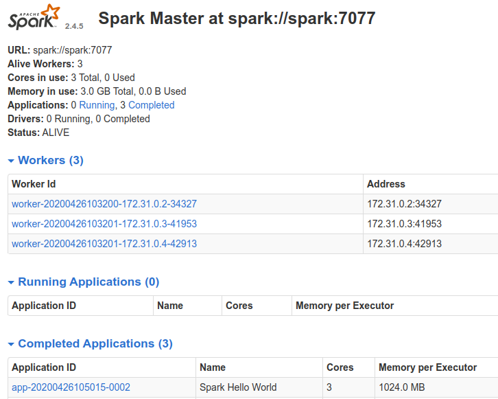

# Airflow Spark

This project contains the following containers:

* postgres: Postgres database for Airflow metadata and a Test database to test whatever you want.
    * Image: postgres:9.6
    * Database Port: 5432
    * References: https://hub.docker.com/_/postgres

* airflow-webserver: Airflow webserver and Scheduler.
    * Image: docker-airflow-spark:1.10.7_3.0.1
    * Port: 8282

* spark: Spark Master.
    * Image: bitnami/spark:3.0.1
    * Port: 8181
    * References: https://github.com/bitnami/bitnami-docker-spark

* spark-worker-N: Spark workers. You can add workers copying the containers and changing the container name inside the docker-compose.yml file.
    * Image: bitnami/spark:3.0.1
    * References: https://github.com/bitnami/bitnami-docker-spark

* jupyter-spark: Jupyter notebook with pyspark for interactive development.
  * Image: jupyter/pyspark-notebook:3.0.1
  * Port: 8888
  * References: 
    * https://jupyter-docker-stacks.readthedocs.io/en/latest/using/selecting.html#jupyter-pyspark-notebook
    * https://hub.docker.com/r/jupyter/pyspark-notebook/tags/

## Architecture components



## Setup

### Clone project

    $ git clone https://github.com/cordon-thiago/airflow-spark

### Build airflow Docker

Inside the airflow-spark/docker/docker-airflow

    $ docker build --rm --force-rm -t docker-airflow-spark:1.10.7_3.0.1 .

Optionally, you can override the arguments in the build to choose specific Spark, Hadoop and Airflow versions. As an example, here is how to build an image containing Airflow version `1.10.14`, Spark version `2.4.7` and Hadoop version `2.7`.

    $ docker build --rm --force-rm \
    -t docker-airflow-spark:1.10.14_2.4.7 . \
    --build-arg AIRFLOW_VERSION=1.10.14 \
    --build-arg SPARK_VERSION=2.4.7 \
    --build-arg HADOOP_VERSION=2.7

Spark and hadoop versions follow the versions as defined at Spark download page: https://spark.apache.org/downloads.html

Airflow versions can be found here: https://pypi.org/project/apache-airflow/#history

If you change the name or the tag of the docker image when building, remember to update the name/tag in docker-compose file.

### Build Jupyter docker

Inside the airflow-spark/docker/docker-jupyter

    $ docker build --rm --force-rm -t jupyter/pyspark-notebook:3.0.1 .

Optionally, you can override the arguments in the build to choose specific Spark and Hadoop versions. As an example, here is how to build an image containing Spark version `2.4.7` and Hadoop version `2.7`.

    $ docker build --rm --force-rm \
    -t jupyter/pyspark-notebook:2.4.7 . \
    --build-arg spark_version=2.4.7 \
    --build-arg hadoop_version=2.7

Spark and hadoop versions follow the versions as defined at Spark download page: https://spark.apache.org/downloads.html

If you change the name or the tag of the docker image when building, remember to update the name/tag in docker-compose file.
### Start containers

Navigate to airflow-spark/docker and:

    $ docker-compose up

If you want to run in background:

    $ docker-compose up -d

Note: when running the docker-compose for the first time, the images postgres:9.6 and bitnami/spark:3.0.1 will be downloaded before the containers started.

### Check if you can access

Airflow: http://localhost:8282

Spark Master: http://localhost:8181

PostgreSql - Database Test:

* Server: localhost:5432
* Database: test
* User: test
* Password: postgres

Postgres - Database airflow:

* Server: localhost:5432
* Database: airflow
* User: airflow
* Password: airflow

Jupyter Notebook: http://127.0.0.1:8888
  * For Jupyter notebook, you must copy the URL with the token generated when the container is started and paste in your browser. The URL with the token can be taken from container logs using:
  
        $ docker logs -f docker_jupyter-spark_1

## How to run a DAG to test

1. Configure spark connection acessing airflow web UI http://localhost:8282 and going to Connections
   

2. Edit the spark_default connection inserting `spark://spark` in Host field and Port `7077`
    

3. Run the spark-test DAG
   
4. Check the DAG log for the task spark_job. You will see the result printed in the log
   

5. Check the spark application in the Spark Master web UI (http://localhost:8181)
   

## How to run the Spark Apps via spark-submit
After started your docker containers, run the command below in your terminal:
```
$ docker exec -it docker_spark_1 spark-submit --master spark://spark:7077 <spark_app_path> [optional]<list_of_app_args>
```

Example running the hellop-world.py application:
```
$ docker exec -it docker_spark_1 spark-submit --master spark://spark:7077 /usr/local/spark/app/hello-world.py /usr/local/spark/resources/data/airflow.cfg
```

## Increasing the number of Spark Workers

You can increase the number of Spark workers just adding new services based on `bitnami/spark:3.0.1` image to the `docker-compose.yml` file like following:

```
spark-worker-n:
        image: bitnami/spark:3.0.1
        user: root
        networks:
            - default_net
        environment:
            - SPARK_MODE=worker
            - SPARK_MASTER_URL=spark://spark:7077
            - SPARK_WORKER_MEMORY=1G
            - SPARK_WORKER_CORES=1
            - SPARK_RPC_AUTHENTICATION_ENABLED=no
            - SPARK_RPC_ENCRYPTION_ENABLED=no
            - SPARK_LOCAL_STORAGE_ENCRYPTION_ENABLED=no
            - SPARK_SSL_ENABLED=no
        volumes:
            - ../spark/app:/usr/local/spark/app # Spark scripts folder (Must be the same path in airflow and Spark Cluster)
            - ../spark/resources/data:/usr/local/spark/resources/data #Data folder (Must be the same path in airflow and Spark Cluster)

```

## Adding Airflow Extra packages

Rebuild Dockerfile (in this example, adding GCP extra):

    $ docker build --rm --build-arg AIRFLOW_DEPS="gcp" -t docker-airflow-spark:1.10.7_3.0.1 .

After successfully built, run docker-compose to start container:

    $ docker-compose up

More info at: https://github.com/puckel/docker-airflow#build

## Useful docker commands

    List Images:
    $ docker images <repository_name>

    List Containers:
    $ docker container ls

    Check container logs:
    $ docker logs -f <container_name>

    To build a Dockerfile after changing sth (run inside directoty containing Dockerfile):
    $ docker build --rm -t <tag_name> .

    Access container bash:
    $ docker exec -i -t <container_name> /bin/bash

## Useful docker-compose commands

    Start Containers:
    $ docker-compose -f <compose-file.yml> up -d

    Stop Containers:
    $ docker-compose -f <compose-file.yml> down --remove-orphans
    
# Extras
## Spark + Postgres sample

* The DAG [spark-postgres.py](dags/spark-postgres.py) loads [movies.csv](spark/resources/data/movies.csv) and [ratings.csv](spark/resources/data/ratings.csv) data into Postgres tables and query these tables to generate a list of top 10 movies with more rates.
  * This DAG runs the load-postgres.py and read-postgres.py applications. These applications are also available in the notebooks [load-postgres-notebook.ipynb](notebooks/load-postgres-notebook.ipynb) and [read-postgres-notebook.ipynb](notebooks/read-postgres-notebook.ipynb).
